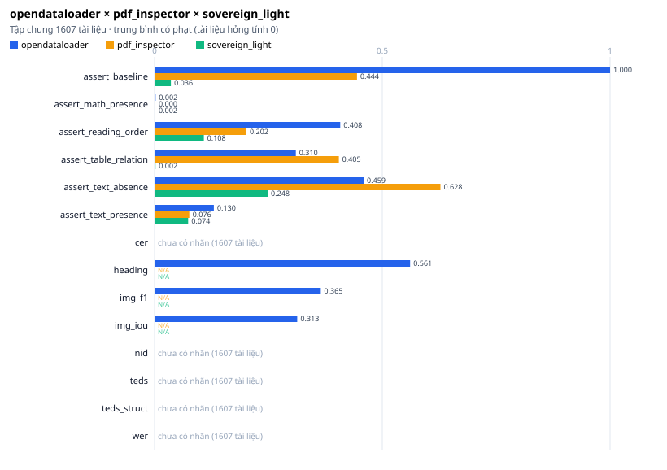
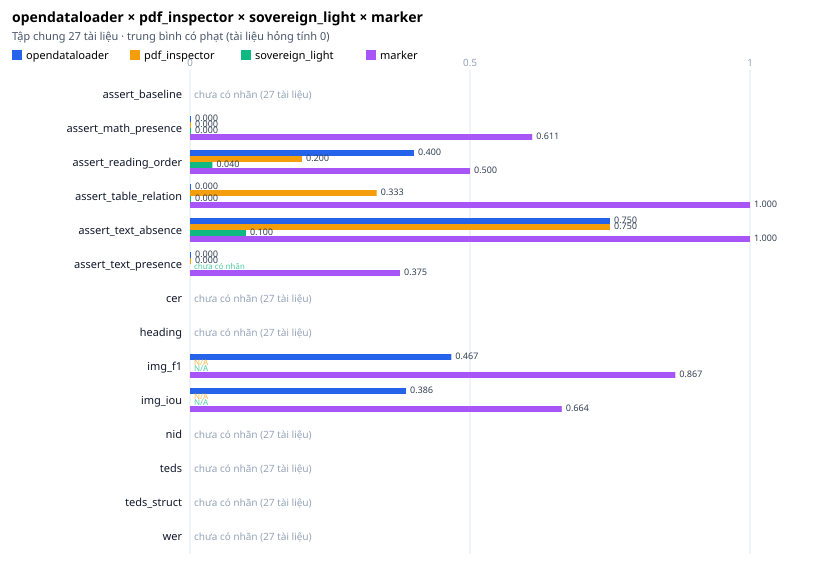
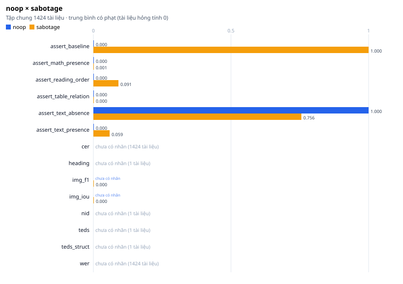

# Biểu đồ so sánh

> Sinh bằng `py -3 scripts/d3_charts.py`. **Không** sửa tay.

Mỗi biểu đồ chỉ vẽ trên tài liệu **mọi engine trong nhóm đều có**. Ô không đo được in chữ, **không** vẽ cột cao 0 — cột cao 0 đọc ra là điểm 0, tức là *đo được và tệ nhất*, trong khi sự thật là chưa từng đo.

## `opendataloader` × `pdf_inspector` × `sovereign_light`

Tập chung: **1607** tài liệu.

## `opendataloader` × `pdf_inspector` × `sovereign_light` × `marker`

Tập chung: **27** tài liệu.

## `noop` × `sabotage`

Tập chung: **1424** tài liệu.

