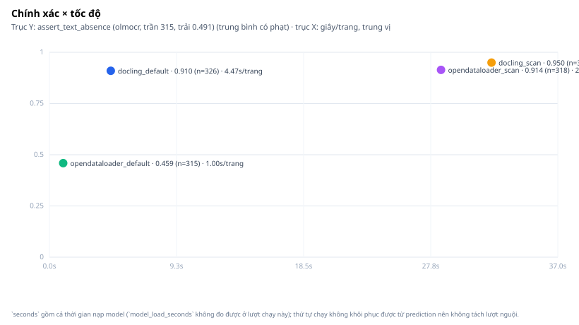
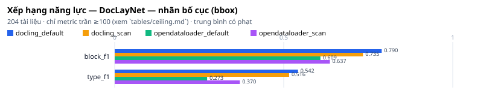
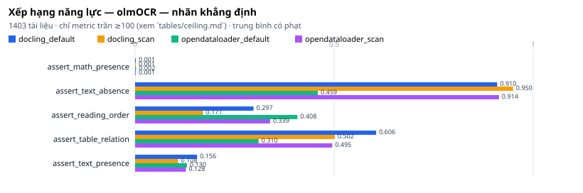
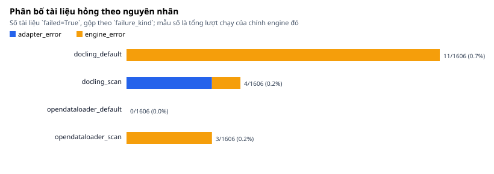
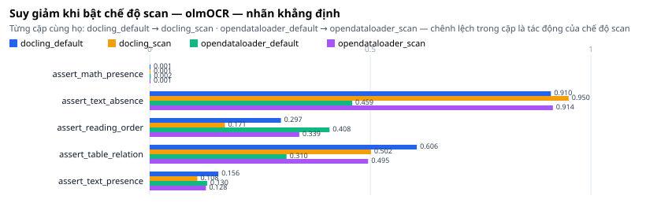

# Báo cáo Nghiên cứu So sánh Đánh giá Hiệu năng các Công cụ OCR và Phân tích Bố cục Tài liệu

**Tác giả:** Đội ngũ Nghiên cứu Sovereign  
**Ngày công bố:** 2025-08-18  
**Số engine hiển thị:** 4  
**Số metric:** 19  
**Tổng dự đoán:** 6424  

---

## Tóm tắt

**Kết quả trong một đoạn.**

- Nhanh nhất: `opendataloader_default` (1.00 giây/trang, trung vị) — chậm nhất `docling_scan` (32.20), chênh khoảng 32 lần.
- DocLayNet — nhãn bố cục (bbox): `docling_default` dẫn đầu 2/2 metric phân biệt được.
- olmOCR — nhãn khẳng định: hoà 1/3 metric giữa `docling_default`, `docling_scan`, `opendataloader_default` — không có engine trội chung.

Ba dòng trên là toàn bộ kết luận; phần còn lại của bài nói vì sao chúng đứng được và ở đâu chúng không đứng được.

Báo cáo này công bố kết quả đánh giá thực nghiệm trên **4 cấu hình engine** với **19 metric** chuẩn hóa, phân chia thành các nhóm năng lực: OCR, Layout, Bảng, Reading Order, Robustness và Hiệu năng.

Bộ mẫu gồm **hai nửa rời nhau** — DocLayNet — nhãn bố cục (bbox) (204 tài liệu) và olmOCR — nhãn khẳng định (1403 tài liệu) — giao nhau **0 tài liệu**. Mọi bảng dưới đây đều tách theo hai nửa đó; không bảng nào đặt một metric của nửa này cạnh một metric của nửa kia, và không có điểm tổng nào cộng ngang qua chúng.

Mọi kết quả được tính toán tất định từ dữ liệu dự đoán tại `calibration/prediction/cpu/` và nhãn chuẩn tại `ground-truth/`. Không sử dụng LLM trong bất kỳ công đoạn tính toán số liệu nào. Các ô hiển thị `— (0 hỏng, 0 chấm được)` là những profile chưa có đủ dữ liệu.

**Bài này bố cục thế nào.** Mỗi mục trả lời đúng một câu hỏi:

| mục | trả lời câu hỏi |
|---|---|
| 1. Đọc kết quả thế nào | `0.790 (n=203, fail 1%)` nghĩa là gì, mỗi metric đo cái gì |
| 2. Trần đo được | ô trống là vì engine kém hay vì bộ mẫu thiếu nhãn |
| 3. Kết quả theo nhóm năng lực | điểm từng engine, tách theo hai nửa corpus |
| 4. Hình | vẫn số đó, nhìn bằng mắt |
| 5. So chéo | so từng cặp engine trên đúng tập tài liệu cả hai cùng chấm được |
| 6. Kết luận | nhanh nhất là ai, đúng nhất là ai, chắc tới đâu |

Cần câu trả lời ngay thì đọc mục 6. Cần biết một con số có tin được không thì đọc mục 2 trước mục 3.

---

## Cảnh báo khi Đọc Bảng

- Giao của cả 4 engine là 1606 tài liệu. Bảng gộp toàn bộ KHÔNG phải một phép so sánh — xem `common-set.md`.

Trong bài báo này, `common-set.md` chính là **mục 5**: ở đó mỗi bảng chỉ chấm trên tài liệu mà mọi engine trong bảng đều xử lý được, nên hai ô cạnh nhau mới so được với nhau.

---

## 1. Đọc Kết quả Thế nào

### 1.1 Một ô trong bảng nói gì

Mọi ô điểm trong báo cáo đều có dạng dưới đây. Lấy một ô thật ở mục 3 làm ví dụ:

```
| block_f1 | 0.790 (n=203, fail 0%) |
```

| mảnh | đọc là |
|---|---|
| `block_f1` | tên metric — đo cái gì thì tra bảng ngay dưới đây |
| `0.790` | điểm trung bình trên thang **0 → 1**, cao hơn là tốt hơn |
| `n=203` | con số đó tính trên **203 tài liệu**, không phải trên cả bộ mẫu |
| `fail 0%` | không tài liệu nào engine chạy lỗi |

**Thang điểm.** `1.000` là engine trùng khớp hoàn toàn với nhãn; `0.000` là không trùng gì.

**Nhưng `0.790` KHÔNG có nghĩa là "đúng 79%".** Đây là chỗ dễ hiểu sai nhất, vì hai lý do:

1. Phần lớn metric ở đây là **F1** — trung bình điều hoà của hai tỉ lệ khác nhau (tìm ra có đúng không, và bỏ sót bao nhiêu). Nó không phải tỉ lệ phần trăm của bất cứ thứ gì đếm được.
2. Điểm phụ thuộc vào **ngưỡng quy ước** trong luật chấm (ví dụ `IoU ≥ 0.5` mới coi là tìm đúng một khung). Đổi ngưỡng thì điểm đổi theo trong khi engine không đổi một dòng nào.

Vì vậy con số này dùng để **xếp hạng các engine trên cùng bộ mẫu, cùng luật chấm** — không dùng để hứa với khách hàng rằng công cụ "chính xác 79%".

**Chênh bao nhiêu mới đáng kể?** Dưới **0.05** thì báo cáo đánh dấu `‡` và không kết luận engine nào hơn. Trên ngưỡng đó vẫn phải xem `results/statistical-tests.json` — chênh lệch lớn trên 15 tài liệu có thể yếu hơn chênh lệch nhỏ trên 1403 tài liệu.

### 1.2 Mỗi metric đo cái gì

Mô tả lấy thẳng từ định nghĩa của chính lớp metric trong mã nguồn, không chép tay — sửa luật chấm mà quên sửa mô tả là không biểu diễn được. Cột *trần* (*ceiling*) là số tài liệu nhiều nhất metric chấm được với bộ nhãn hiện có (mục 2) — cột này giải thích ở mục 2 ngay dưới đây. Bảng thuật ngữ đầy đủ: `tables/glossary.md`.

**Năm chữ viết tắt trong cột dưới đây.** Tên giữ nguyên tiếng Anh vì đó là tên chuẩn trong tài liệu ngành:

| viết tắt | tên đầy đủ | nói bằng lời thường |
|---|---|---|
| **F1** | F1-score | gộp hai câu hỏi thành một điểm: cái engine chỉ ra có đúng không, và nó bỏ sót bao nhiêu. Chỉ cao khi **cả hai** cùng tốt |
| **macro-F1** | macro-averaged F1 | tính F1 riêng cho từng loại rồi lấy trung bình đều tay — loại hiếm gặp có sức nặng ngang loại phổ biến |
| **IoU** | Intersection over Union | hai khung chồng nhau bao nhiêu: phần chung chia phần tổng. `1.0` là trùng khít, `0.0` là rời hẳn |
| **TEDS** | Tree-Edit-Distance Similarity | so hai cái bảng như so hai cái cây: phải sửa bao nhiêu bước thì bảng engine thành bảng nhãn |
| **NID** | Normalized Insertion-Deletion distance | so hai **thứ tự đọc**: phải chuyển bao nhiêu bước thì trình tự engine đọc thành trình tự đúng |

Còn `assert_*` không thuộc nhóm trên: nhãn của chúng là các **khẳng định đúng/sai** về tài liệu ("trang này có công thức toán"), nên điểm là tỉ lệ khẳng định engine trả lời đúng — cái này đọc thành phần trăm được.

#### Text & OCR

| metric | nửa corpus | trần | đo cái gì |
|---|---|---:|---|
| `cer` | doclaynet | 0 | 1 − tỉ lệ lỗi ký tự. |
| `wer` | doclaynet | 0 | 1 − tỉ lệ lỗi từ. |
| `diacritics_acc` | doclaynet | 0 | Tỷ lệ ký tự có dấu được engine đặt đúng dấu. |
| `assert_text_presence` | olmocr | 160 | Chuỗi phải có mặt trong đầu ra. |
| `assert_text_absence` | olmocr | 315 | Chuỗi **không** được có mặt (thường là đầu trang / chân trang lọt vào). |

#### Layout & Structure

| metric | nửa corpus | trần | đo cái gì |
|---|---|---:|---|
| `block_f1` | doclaynet | 203 | F1 của phép ghép khối ở IoU ≥ ngưỡng — "tìm đúng bao nhiêu khối". |
| `type_f1` | doclaynet | 203 | Macro-F1 theo loại khối — "gọi tên khối có đúng không". |
| `heading` | doclaynet | 17 | Phân cấp tiêu đề. 1.0 = mọi quan hệ trên/dưới giữa các tiêu đề đều khớp nhãn. |
| `img_f1` | doclaynet | 64 | F1 của phép ghép ảnh ở IoU ≥ ngưỡng — "tìm đúng bao nhiêu ảnh". |
| `img_iou` | doclaynet | 64 | Chất lượng khung — "tìm ra rồi thì cắt có sát không". |

#### Tables

| metric | nửa corpus | trần | đo cái gì |
|---|---|---:|---|
| `teds` | doclaynet | 0 | TEDS đầy đủ: cấu trúc **và** nội dung ô. |
| `teds_struct` | doclaynet | 0 | TEDS-Struct: chỉ cấu trúc, bỏ nội dung ô. |
| `cell_f1` | doclaynet | 0 | F1 trên ô bảng theo toạ độ lưới — "ô nào bị mất, ô nào bịa ra". |
| `table_recall` | doclaynet | 43 | Tỷ lệ bảng nhãn được engine định vị đúng ở IoU ≥ 0.5. |
| `assert_table_relation` | olmocr | 188 | Ô bảng phải có lân cận / tiêu đề như mô tả. |

#### Reading Order

| metric | nửa corpus | trần | đo cái gì |
|---|---|---:|---|
| `nid` | doclaynet | 0 | Thứ tự đọc. 1.0 = đúng thứ tự nhãn; đảo đoạn thì tụt. |
| `assert_reading_order` | olmocr | 314 | `before` phải đứng trước `after` trong đầu ra. |

#### Robustness & Base

| metric | nửa corpus | trần | đo cái gì |
|---|---|---:|---|
| `assert_baseline` | olmocr | 9 | Vệ sinh đầu ra: không rỗng, không ký tự thay thế. |
| `assert_math_presence` | olmocr | 558 | ⚠️ **CẬN DƯỚI.** So chuỗi sau chuẩn hoá, không dựng ảnh như olmOCR. |

`cell_f1` **không** đo chất lượng ô ở bộ mẫu này. Không nhãn nào có ô, nên tài liệu duy nhất chấm được là tài liệu engine **tự sinh ra bảng** — theo định nghĩa metric thì điểm luôn 0.000 và thông tin nằm ở `n`: `n` là số tài liệu bị bảng ảo. **Thấp hơn là tốt hơn**, ngược chiều mọi metric còn lại, nên nó bị loại khỏi mọi bảng xếp hạng theo điểm. Thêm engine thứ tư cũng không đổi được điều này: thiếu ô trong nhãn là thiếu ở **bộ mẫu**, engine nào chạy vào cũng rơi đúng nhánh đó. Muốn `cell_f1` có nghĩa thì phải gán nhãn ô, không phải chạy thêm lượt.

---

## 2. Trần Đo được của Bộ mẫu (*measurable ceiling*)

Trần tính **chỉ từ nhãn**, trước khi chạy engine nào: nó là giới hạn của bộ mẫu, không phải của engine. Một ô trống chỉ đọc được đúng khi biết trần của metric ấy là 0 (bộ mẫu thiếu nhãn) hay 203 (engine không làm được).

| bậc | số metric | nghĩa |
|---|---:|---|
| đo được | 7 | trần ≥ 100 tài liệu — kết luận đứng được |
| mỏng | 5 | trần thấp — đọc được, nhưng mỗi tài liệu kéo điểm rất mạnh |
| trần 0 | 7 | bộ mẫu **không có nhãn** để chấm; engine không liên quan |

Metric trần 0 ở lượt này: `cell_f1`, `cer`, `diacritics_acc`, `nid`, `teds`, `teds_struct`, `wer`. Chúng vẫn được in trong mọi bảng, ô ghi lý do — bỏ dòng đi là giấu chuyện bộ mẫu thiếu nhãn.

Từng dòng kèm lý do: `tables/ceiling.md` · dữ liệu máy đọc: `results/measurable-ceiling.json`.

---

## 3. Kết quả theo Nhóm Năng lực

Báo cáo không dùng một điểm tổng duy nhất — điểm tổng che mất trade-off giữa các năng lực, và ở đây nó còn phải cộng ngang qua hai bộ tài liệu rời nhau. Mỗi bảng dưới đây thuộc **một** nửa corpus, lọc về đúng tài liệu của nửa đó.

### DocLayNet — nhãn bố cục (bbox)

204 tài liệu, nhãn là khung + loại khối. Không giao một tài liệu nào với nửa dưới, nên **không so ô của hai bảng với nhau**.

**Đọc nhanh.** Trong 13 metric của nửa này, 2 metric vừa đo được vừa tách được các engine ra (`block_f1`, `type_f1`); trên số đó, `docling_default` dẫn đầu với 2/2. Các dòng còn lại ghi `chưa có nhãn` hoặc `N/A` — đó là giới hạn của bộ mẫu, không phải điểm 0 của engine.

#### Text & OCR

<!-- trace: aggregate:text_ocr:docling_default -->
<!-- trace: aggregate:text_ocr:docling_scan -->
<!-- trace: aggregate:text_ocr:opendataloader_default -->
<!-- trace: aggregate:text_ocr:opendataloader_scan -->

| Metric | docling_default | docling_scan | opendataloader_default | opendataloader_scan |
|---|---|---|---|---|
| **n (tài liệu)** | 203 | 203 | 203 | 203 |
| `cer` | chưa có nhãn (203 tài liệu) | chưa có nhãn (203 tài liệu) | chưa có nhãn (203 tài liệu) | chưa có nhãn (203 tài liệu) |
| `wer` | chưa có nhãn (203 tài liệu) | chưa có nhãn (203 tài liệu) | chưa có nhãn (203 tài liệu) | chưa có nhãn (203 tài liệu) |
| `diacritics_acc` | chưa có nhãn (203 tài liệu) | chưa có nhãn (203 tài liệu) | chưa có nhãn (203 tài liệu) | chưa có nhãn (203 tài liệu) |


#### Layout & Structure

<!-- trace: aggregate:layout_structure:docling_default -->
<!-- trace: aggregate:layout_structure:docling_scan -->
<!-- trace: aggregate:layout_structure:opendataloader_default -->
<!-- trace: aggregate:layout_structure:opendataloader_scan -->

| Metric | docling_default | docling_scan | opendataloader_default | opendataloader_scan |
|---|---|---|---|---|
| **n (tài liệu)** | 203 | 203 | 203 | 203 |
| `block_f1` | 0.790 (n=203, fail 0%) | 0.735 (n=203, fail 0%) | 0.609 (n=203, fail 0%) | 0.637 (n=203, fail 0%) |
| `type_f1` | 0.542 (n=203, fail 0%) | 0.516 (n=203, fail 0%) | 0.273 (n=203, fail 0%) | 0.370 (n=203, fail 0%) |
| `heading` | 0.217 (n=15, fail 0%) | 0.195 (n=15, fail 0%) | 0.561 (n=15, fail 0%) | 0.195 (n=15, fail 0%) |
| `img_f1` | 0.828 (n=70, fail 0%) | 0.828 (n=70, fail 0%) | 0.365 (n=98, fail 0%) | 0.785 (n=70, fail 0%) |
| `img_iou` | 0.777 (n=70, fail 0%) | 0.777 (n=70, fail 0%) | 0.313 (n=98, fail 0%) | 0.708 (n=70, fail 0%) |


#### Tables

<!-- trace: aggregate:tables:docling_default -->
<!-- trace: aggregate:tables:docling_scan -->
<!-- trace: aggregate:tables:opendataloader_default -->
<!-- trace: aggregate:tables:opendataloader_scan -->

| Metric | docling_default | docling_scan | opendataloader_default | opendataloader_scan |
|---|---|---|---|---|
| **n (tài liệu)** | 203 | 203 | 203 | 203 |
| `teds` | chưa có nhãn (203 tài liệu) | chưa có nhãn (203 tài liệu) | chưa có nhãn (203 tài liệu) | chưa có nhãn (203 tài liệu) |
| `teds_struct` | chưa có nhãn (203 tài liệu) | chưa có nhãn (203 tài liệu) | chưa có nhãn (203 tài liệu) | chưa có nhãn (203 tài liệu) |
| `cell_f1` | 0.000 (n=2, fail 0%) | 0.000 (n=2, fail 0%) | 0.000 (n=7, fail 0%) | 0.000 (n=2, fail 0%) |
| `table_recall` | 0.808 (n=43, fail 0%) | 0.802 (n=43, fail 0%) | 0.211 (n=43, fail 0%) | 0.779 (n=43, fail 0%) |


#### Reading Order

<!-- trace: aggregate:reading_order:docling_default -->
<!-- trace: aggregate:reading_order:docling_scan -->
<!-- trace: aggregate:reading_order:opendataloader_default -->
<!-- trace: aggregate:reading_order:opendataloader_scan -->

| Metric | docling_default | docling_scan | opendataloader_default | opendataloader_scan |
|---|---|---|---|---|
| **n (tài liệu)** | 203 | 203 | 203 | 203 |
| `nid` | chưa có nhãn (203 tài liệu) | chưa có nhãn (203 tài liệu) | chưa có nhãn (203 tài liệu) | chưa có nhãn (203 tài liệu) |


##### DocLayNet — nhãn bố cục (bbox) — tổng quan mọi metric của nửa này

<!-- trace: aggregate:all_metrics:docling_default -->
<!-- trace: aggregate:all_metrics:docling_scan -->
<!-- trace: aggregate:all_metrics:opendataloader_default -->
<!-- trace: aggregate:all_metrics:opendataloader_scan -->

| Metric | docling_default | docling_scan | opendataloader_default | opendataloader_scan |
|---|---|---|---|---|
| **n (tài liệu)** | 203 | 203 | 203 | 203 |
| `block_f1` | 0.790 (n=203, fail 0%) | 0.735 (n=203, fail 0%) | 0.609 (n=203, fail 0%) | 0.637 (n=203, fail 0%) |
| `type_f1` | 0.542 (n=203, fail 0%) | 0.516 (n=203, fail 0%) | 0.273 (n=203, fail 0%) | 0.370 (n=203, fail 0%) |
| `img_f1` | 0.828 (n=70, fail 0%) | 0.828 (n=70, fail 0%) | 0.365 (n=98, fail 0%) | 0.785 (n=70, fail 0%) |
| `img_iou` | 0.777 (n=70, fail 0%) | 0.777 (n=70, fail 0%) | 0.313 (n=98, fail 0%) | 0.708 (n=70, fail 0%) |
| `table_recall` | 0.808 (n=43, fail 0%) | 0.802 (n=43, fail 0%) | 0.211 (n=43, fail 0%) | 0.779 (n=43, fail 0%) |
| `heading` | 0.217 (n=15, fail 0%) | 0.195 (n=15, fail 0%) | 0.561 (n=15, fail 0%) | 0.195 (n=15, fail 0%) |
| `cell_f1` | 0.000 (n=2, fail 0%) | 0.000 (n=2, fail 0%) | 0.000 (n=7, fail 0%) | 0.000 (n=2, fail 0%) |
| `cer` | chưa có nhãn (203 tài liệu) | chưa có nhãn (203 tài liệu) | chưa có nhãn (203 tài liệu) | chưa có nhãn (203 tài liệu) |
| `diacritics_acc` | chưa có nhãn (203 tài liệu) | chưa có nhãn (203 tài liệu) | chưa có nhãn (203 tài liệu) | chưa có nhãn (203 tài liệu) |
| `nid` | chưa có nhãn (203 tài liệu) | chưa có nhãn (203 tài liệu) | chưa có nhãn (203 tài liệu) | chưa có nhãn (203 tài liệu) |
| `teds` | chưa có nhãn (203 tài liệu) | chưa có nhãn (203 tài liệu) | chưa có nhãn (203 tài liệu) | chưa có nhãn (203 tài liệu) |
| `teds_struct` | chưa có nhãn (203 tài liệu) | chưa có nhãn (203 tài liệu) | chưa có nhãn (203 tài liệu) | chưa có nhãn (203 tài liệu) |
| `wer` | chưa có nhãn (203 tài liệu) | chưa có nhãn (203 tài liệu) | chưa có nhãn (203 tài liệu) | chưa có nhãn (203 tài liệu) |


Ô `N/A` = engine không có năng lực để metric chạm tới. `chưa có nhãn` = bộ mẫu chưa có nhãn hợp loại để đối chiếu (mục 2).

### olmOCR — nhãn khẳng định

1403 tài liệu, nhãn là các khẳng định đúng/sai về nội dung. Trần đo được của từng metric xem `tables/ceiling.md`.

**Đọc nhanh.** Trong 6 metric của nửa này, 3 metric vừa đo được vừa tách được các engine ra (`assert_reading_order`, `assert_table_relation`, `assert_text_absence`); trên số đó, hoà giữa `docling_default`, `docling_scan`, `opendataloader_default` với 1/3. Các dòng còn lại ghi `chưa có nhãn` hoặc `N/A` — đó là giới hạn của bộ mẫu, không phải điểm 0 của engine.

#### Text & OCR

<!-- trace: aggregate:text_ocr:docling_default -->
<!-- trace: aggregate:text_ocr:docling_scan -->
<!-- trace: aggregate:text_ocr:opendataloader_default -->
<!-- trace: aggregate:text_ocr:opendataloader_scan -->

| Metric | docling_default | docling_scan | opendataloader_default | opendataloader_scan |
|---|---|---|---|---|
| **n (tài liệu)** | 1403 | 1403 | 1403 | 1403 |
| `assert_text_presence` | 0.156 (n=171, fail 6%) | 0.108 (n=163, fail 2%) | 0.130 (n=160, fail 0%) | 0.128 (n=163, fail 2%) |
| `assert_text_absence` | 0.910 (n=326, fail 3%) | 0.950 (n=318, fail 1%) | 0.459 (n=315, fail 0%) | 0.914 (n=318, fail 1%) |


#### Tables

<!-- trace: aggregate:tables:docling_default -->
<!-- trace: aggregate:tables:docling_scan -->
<!-- trace: aggregate:tables:opendataloader_default -->
<!-- trace: aggregate:tables:opendataloader_scan -->

| Metric | docling_default | docling_scan | opendataloader_default | opendataloader_scan |
|---|---|---|---|---|
| **n (tài liệu)** | 1403 | 1403 | 1403 | 1403 |
| `assert_table_relation` | 0.606 (n=199, fail 6%) | 0.502 (n=191, fail 2%) | 0.310 (n=188, fail 0%) | 0.495 (n=191, fail 2%) |


#### Reading Order

<!-- trace: aggregate:reading_order:docling_default -->
<!-- trace: aggregate:reading_order:docling_scan -->
<!-- trace: aggregate:reading_order:opendataloader_default -->
<!-- trace: aggregate:reading_order:opendataloader_scan -->

| Metric | docling_default | docling_scan | opendataloader_default | opendataloader_scan |
|---|---|---|---|---|
| **n (tài liệu)** | 1403 | 1403 | 1403 | 1403 |
| `assert_reading_order` | 0.297 (n=325, fail 3%) | 0.171 (n=316, fail 1%) | 0.408 (n=314, fail 0%) | 0.339 (n=317, fail 1%) |


#### Robustness & Base

<!-- trace: aggregate:robustness_base:docling_default -->
<!-- trace: aggregate:robustness_base:docling_scan -->
<!-- trace: aggregate:robustness_base:opendataloader_default -->
<!-- trace: aggregate:robustness_base:opendataloader_scan -->

| Metric | docling_default | docling_scan | opendataloader_default | opendataloader_scan |
|---|---|---|---|---|
| **n (tài liệu)** | 1403 | 1403 | 1403 | 1403 |
| `assert_baseline` | 0.450 (n=20, fail 55%) | 0.667 (n=12, fail 33%) | 1.000 (n=9, fail 0%) | 0.750 (n=12, fail 25%) |
| `assert_math_presence` | 0.001 (n=558, fail 2%) | 0.001 (n=562, fail 1%) | 0.002 (n=558, fail 0%) | 0.001 (n=558, fail 1%) |


##### olmOCR — nhãn khẳng định — tổng quan mọi metric của nửa này

<!-- trace: aggregate:all_metrics:docling_default -->
<!-- trace: aggregate:all_metrics:docling_scan -->
<!-- trace: aggregate:all_metrics:opendataloader_default -->
<!-- trace: aggregate:all_metrics:opendataloader_scan -->

| Metric | docling_default | docling_scan | opendataloader_default | opendataloader_scan |
|---|---|---|---|---|
| **n (tài liệu)** | 1403 | 1403 | 1403 | 1403 |
| `assert_math_presence` | 0.001 (n=558, fail 2%) | 0.001 (n=562, fail 1%) | 0.002 (n=558, fail 0%) | 0.001 (n=558, fail 1%) |
| `assert_text_absence` | 0.910 (n=326, fail 3%) | 0.950 (n=318, fail 1%) | 0.459 (n=315, fail 0%) | 0.914 (n=318, fail 1%) |
| `assert_reading_order` | 0.297 (n=325, fail 3%) | 0.171 (n=316, fail 1%) | 0.408 (n=314, fail 0%) | 0.339 (n=317, fail 1%) |
| `assert_table_relation` | 0.606 (n=199, fail 6%) | 0.502 (n=191, fail 2%) | 0.310 (n=188, fail 0%) | 0.495 (n=191, fail 2%) |
| `assert_text_presence` | 0.156 (n=171, fail 6%) | 0.108 (n=163, fail 2%) | 0.130 (n=160, fail 0%) | 0.128 (n=163, fail 2%) |
| `assert_baseline` | 0.450 (n=20, fail 55%) | 0.667 (n=12, fail 33%) | 1.000 (n=9, fail 0%) | 0.750 (n=12, fail 25%) |


Ô `N/A` = engine không có năng lực để metric chạm tới. `chưa có nhãn` = bộ mẫu chưa có nhãn hợp loại để đối chiếu (mục 2).

---

## 4. Hình

Mọi hình vẽ từ chính bảng ở mục 3 — không hình nào có nguồn riêng.

### Nhanh và đúng: đánh đổi giữa hai bên



*File: `figures/accuracy-speed.svg`*

**Cách đọc.** Trục ngang là **giây mỗi trang, trung vị**; trục dọc là một metric có tên (metric tách các engine ra xa nhất, tên metric ghi ngay trên trục). Góc trên bên trái là vừa nhanh vừa đúng. Đọc kèm hai hạn chế in ở chân hình: `seconds` gồm cả thời gian nạp model, và thứ tự chạy không khôi phục được nên không tách được lượt nguội.

### Xếp hạng engine theo từng metric — nửa DocLayNet



*File: `figures/capability-ranking-doclaynet.svg`*

**Cách đọc.** Mỗi hàng là một metric, mỗi điểm là một engine; trục ngang là trung bình có phạt. Chỉ vẽ metric bậc *đo được* — metric trần thấp nằm ở `tables/ceiling.md`, không lên hình, vì một điểm dựng trên 9 tài liệu trông y hệt một điểm dựng trên 203 tài liệu.

### Xếp hạng engine theo từng metric — nửa olmOCR



*File: `figures/capability-ranking-olmocr.svg`*

**Cách đọc.** Mỗi hàng là một metric, mỗi điểm là một engine; trục ngang là trung bình có phạt. Chỉ vẽ metric bậc *đo được* — metric trần thấp nằm ở `tables/ceiling.md`, không lên hình, vì một điểm dựng trên 9 tài liệu trông y hệt một điểm dựng trên 203 tài liệu.

### Tài liệu engine không xử lý được



*File: `figures/failure-distribution.svg`*

**Cách đọc.** Tài liệu engine **không xử lý được**, tách theo loại hỏng. Đây là con số đứng cạnh mọi điểm trong báo cáo: một engine điểm cao trên phần nó chạy được mà hỏng 20% đầu vào thì không dùng được, và bảng điểm một mình không nói ra điều đó.

### Bật chế độ scan thì điểm đổi thế nào — nửa DocLayNet


*File: `figures/scan-degradation-doclaynet.svg`*

**Cách đọc.** So `*_default` với `*_scan` của **cùng một họ engine**. Cột hướng xuống nghĩa là bật chế độ scan làm điểm tệ đi. Họ engine thiếu một trong hai profile thì không có cột — hình ghi rõ thiếu cái gì thay vì vẽ cột 0.

### Bật chế độ scan thì điểm đổi thế nào — nửa olmOCR



*File: `figures/scan-degradation-olmocr.svg`*

**Cách đọc.** So `*_default` với `*_scan` của **cùng một họ engine**. Cột hướng xuống nghĩa là bật chế độ scan làm điểm tệ đi. Họ engine thiếu một trong hai profile thì không có cột — hình ghi rõ thiếu cái gì thay vì vẽ cột 0.

---

## 5. So chéo trên Tập Tài liệu Chung

> Sinh bằng `py -3 scripts/build_research_report.py`. **Không** sửa tay.

> **Chưa quen bộ metric này?** `glossary.md` giải thích từng metric đo cái gì và mọi ký hiệu trong bảng (`n`, `% hỏng`, `N/A`, `trần`, `†`, `‡`).
>
> Đọc theo thứ tự: **`n` trước, điểm sau** — một điểm cao trên 9 tài liệu không so được với một điểm thấp hơn trên 1403 tài liệu.

Mỗi bảng dưới đây chỉ chấm trên tài liệu **mọi engine trong bảng đều có**. Đây là bảng duy nhất mà việc so hai ô cạnh nhau là hợp lệ.

Mọi nhóm dưới đây đều cắt làm hai nửa corpus:

- **DocLayNet — nhãn bố cục (bbox)** — 204 tài liệu, nhãn là khung + loại khối. Không giao một tài liệu nào với nửa dưới, nên **không so ô của hai bảng với nhau**.
- **olmOCR — nhãn khẳng định** — 1403 tài liệu, nhãn là các khẳng định đúng/sai về nội dung. Trần đo được của từng metric xem `tables/ceiling.md`.

#### `docling_default` × `opendataloader_default`

Cùng chế độ `default`, khác họ engine — bảng này trả lời: ở cùng một cách chạy thì engine nào chấm cao hơn.

Tập chung: **1606** tài liệu.

##### DocLayNet — nhãn bố cục (bbox) — 203 tài liệu

| metric | docling_default | opendataloader_default |
|---|---|---|
| **n (tài liệu)** | 203 | 203 |
| block_f1 | 0.790 (n=203, fail 0%) | 0.609 (n=203, fail 0%) |
| type_f1 | 0.542 (n=203, fail 0%) | 0.273 (n=203, fail 0%) |
| img_f1 | 0.828 (n=70, fail 0%) | 0.365 (n=98, fail 0%) |
| img_iou | 0.777 (n=70, fail 0%) | 0.313 (n=98, fail 0%) |
| table_recall | 0.808 (n=43, fail 0%) | 0.211 (n=43, fail 0%) |
| heading | 0.217 (n=15, fail 0%) | 0.561 (n=15, fail 0%) |
| cell_f1 † | 0.000 (n=2, fail 0%) | 0.000 (n=7, fail 0%) |
| cer | chưa có nhãn (203 tài liệu) | chưa có nhãn (203 tài liệu) |
| diacritics_acc | chưa có nhãn (203 tài liệu) | chưa có nhãn (203 tài liệu) |
| nid | chưa có nhãn (203 tài liệu) | chưa có nhãn (203 tài liệu) |
| teds | chưa có nhãn (203 tài liệu) | chưa có nhãn (203 tài liệu) |
| teds_struct | chưa có nhãn (203 tài liệu) | chưa có nhãn (203 tài liệu) |
| wer | chưa có nhãn (203 tài liệu) | chưa có nhãn (203 tài liệu) |

##### olmOCR — nhãn khẳng định — 1403 tài liệu

| metric | docling_default | opendataloader_default |
|---|---|---|
| **n (tài liệu)** | 1403 | 1403 |
| assert_math_presence | 0.001 (n=558, fail 2%) | 0.002 (n=558, fail 0%) |
| assert_text_absence | 0.910 (n=326, fail 3%) | 0.459 (n=315, fail 0%) |
| assert_reading_order | 0.297 (n=325, fail 3%) | 0.408 (n=314, fail 0%) |
| assert_table_relation | 0.606 (n=199, fail 6%) | 0.310 (n=188, fail 0%) |
| assert_text_presence | 0.156 (n=171, fail 6%) | 0.130 (n=160, fail 0%) |
| assert_baseline | 0.450 (n=20, fail 55%) | 1.000 (n=9, fail 0%) |

#### `docling_scan` × `opendataloader_scan`

Cùng chế độ `scan`, khác họ engine — bảng này trả lời: ở cùng một cách chạy thì engine nào chấm cao hơn.

Tập chung: **1606** tài liệu.

##### DocLayNet — nhãn bố cục (bbox) — 203 tài liệu

| metric | docling_scan | opendataloader_scan |
|---|---|---|
| **n (tài liệu)** | 203 | 203 |
| block_f1 | 0.735 (n=203, fail 0%) | 0.637 (n=203, fail 0%) |
| type_f1 | 0.516 (n=203, fail 0%) | 0.370 (n=203, fail 0%) |
| img_f1 | 0.828 (n=70, fail 0%) | 0.785 (n=70, fail 0%) |
| img_iou | 0.777 (n=70, fail 0%) | 0.708 (n=70, fail 0%) |
| table_recall | 0.802 (n=43, fail 0%) | 0.779 (n=43, fail 0%) |
| heading | 0.195 (n=15, fail 0%) | 0.195 (n=15, fail 0%) |
| cell_f1 † | 0.000 (n=2, fail 0%) | 0.000 (n=2, fail 0%) |
| cer | chưa có nhãn (203 tài liệu) | chưa có nhãn (203 tài liệu) |
| diacritics_acc | chưa có nhãn (203 tài liệu) | chưa có nhãn (203 tài liệu) |
| nid | chưa có nhãn (203 tài liệu) | chưa có nhãn (203 tài liệu) |
| teds | chưa có nhãn (203 tài liệu) | chưa có nhãn (203 tài liệu) |
| teds_struct | chưa có nhãn (203 tài liệu) | chưa có nhãn (203 tài liệu) |
| wer | chưa có nhãn (203 tài liệu) | chưa có nhãn (203 tài liệu) |

##### olmOCR — nhãn khẳng định — 1403 tài liệu

| metric | docling_scan | opendataloader_scan |
|---|---|---|
| **n (tài liệu)** | 1403 | 1403 |
| assert_math_presence | 0.001 (n=562, fail 1%) | 0.001 (n=558, fail 1%) |
| assert_text_absence | 0.950 (n=318, fail 1%) | 0.914 (n=318, fail 1%) |
| assert_reading_order | 0.171 (n=316, fail 1%) | 0.339 (n=317, fail 1%) |
| assert_table_relation | 0.502 (n=191, fail 2%) | 0.495 (n=191, fail 2%) |
| assert_text_presence | 0.108 (n=163, fail 2%) | 0.128 (n=163, fail 2%) |
| assert_baseline | 0.667 (n=12, fail 33%) | 0.750 (n=12, fail 25%) |

#### `docling_default` × `docling_scan`

Cùng một họ engine (`docling`), khác chế độ — bảng này trả lời: bật chế độ scan lên thì được gì và mất gì.

Tập chung: **1606** tài liệu.

##### DocLayNet — nhãn bố cục (bbox) — 203 tài liệu

| metric | docling_default | docling_scan |
|---|---|---|
| **n (tài liệu)** | 203 | 203 |
| block_f1 | 0.790 (n=203, fail 0%) | 0.735 (n=203, fail 0%) |
| type_f1 | 0.542 (n=203, fail 0%) | 0.516 (n=203, fail 0%) |
| img_f1 | 0.828 (n=70, fail 0%) | 0.828 (n=70, fail 0%) |
| img_iou | 0.777 (n=70, fail 0%) | 0.777 (n=70, fail 0%) |
| table_recall | 0.808 (n=43, fail 0%) | 0.802 (n=43, fail 0%) |
| heading | 0.217 (n=15, fail 0%) | 0.195 (n=15, fail 0%) |
| cell_f1 † | 0.000 (n=2, fail 0%) | 0.000 (n=2, fail 0%) |
| cer | chưa có nhãn (203 tài liệu) | chưa có nhãn (203 tài liệu) |
| diacritics_acc | chưa có nhãn (203 tài liệu) | chưa có nhãn (203 tài liệu) |
| nid | chưa có nhãn (203 tài liệu) | chưa có nhãn (203 tài liệu) |
| teds | chưa có nhãn (203 tài liệu) | chưa có nhãn (203 tài liệu) |
| teds_struct | chưa có nhãn (203 tài liệu) | chưa có nhãn (203 tài liệu) |
| wer | chưa có nhãn (203 tài liệu) | chưa có nhãn (203 tài liệu) |

##### olmOCR — nhãn khẳng định — 1403 tài liệu

| metric | docling_default | docling_scan |
|---|---|---|
| **n (tài liệu)** | 1403 | 1403 |
| assert_math_presence | 0.001 (n=558, fail 2%) | 0.001 (n=562, fail 1%) |
| assert_text_absence | 0.910 (n=326, fail 3%) | 0.950 (n=318, fail 1%) |
| assert_reading_order | 0.297 (n=325, fail 3%) | 0.171 (n=316, fail 1%) |
| assert_table_relation | 0.606 (n=199, fail 6%) | 0.502 (n=191, fail 2%) |
| assert_text_presence | 0.156 (n=171, fail 6%) | 0.108 (n=163, fail 2%) |
| assert_baseline | 0.450 (n=20, fail 55%) | 0.667 (n=12, fail 33%) |

#### `opendataloader_default` × `opendataloader_scan`

Cùng một họ engine (`opendataloader`), khác chế độ — bảng này trả lời: bật chế độ scan lên thì được gì và mất gì.

Tập chung: **1606** tài liệu.

##### DocLayNet — nhãn bố cục (bbox) — 203 tài liệu

| metric | opendataloader_default | opendataloader_scan |
|---|---|---|
| **n (tài liệu)** | 203 | 203 |
| block_f1 | 0.609 (n=203, fail 0%) | 0.637 (n=203, fail 0%) |
| type_f1 | 0.273 (n=203, fail 0%) | 0.370 (n=203, fail 0%) |
| img_f1 | 0.365 (n=98, fail 0%) | 0.785 (n=70, fail 0%) |
| img_iou | 0.313 (n=98, fail 0%) | 0.708 (n=70, fail 0%) |
| table_recall | 0.211 (n=43, fail 0%) | 0.779 (n=43, fail 0%) |
| heading | 0.561 (n=15, fail 0%) | 0.195 (n=15, fail 0%) |
| cell_f1 † | 0.000 (n=7, fail 0%) | 0.000 (n=2, fail 0%) |
| cer | chưa có nhãn (203 tài liệu) | chưa có nhãn (203 tài liệu) |
| diacritics_acc | chưa có nhãn (203 tài liệu) | chưa có nhãn (203 tài liệu) |
| nid | chưa có nhãn (203 tài liệu) | chưa có nhãn (203 tài liệu) |
| teds | chưa có nhãn (203 tài liệu) | chưa có nhãn (203 tài liệu) |
| teds_struct | chưa có nhãn (203 tài liệu) | chưa có nhãn (203 tài liệu) |
| wer | chưa có nhãn (203 tài liệu) | chưa có nhãn (203 tài liệu) |

##### olmOCR — nhãn khẳng định — 1403 tài liệu

| metric | opendataloader_default | opendataloader_scan |
|---|---|---|
| **n (tài liệu)** | 1403 | 1403 |
| assert_math_presence | 0.002 (n=558, fail 0%) | 0.001 (n=558, fail 1%) |
| assert_text_absence | 0.459 (n=315, fail 0%) | 0.914 (n=318, fail 1%) |
| assert_reading_order | 0.408 (n=314, fail 0%) | 0.339 (n=317, fail 1%) |
| assert_table_relation | 0.310 (n=188, fail 0%) | 0.495 (n=191, fail 2%) |
| assert_text_presence | 0.130 (n=160, fail 0%) | 0.128 (n=163, fail 2%) |
| assert_baseline | 1.000 (n=9, fail 0%) | 0.750 (n=12, fail 25%) |

#### `docling_default` × `opendataloader_default` × `opendataloader_scan`

Nhiều họ engine và nhiều chế độ cùng lúc — bảng tổng, dùng để nhìn tất cả trên **cùng một** tập tài liệu; tách riêng từng câu hỏi thì xem các bảng trên.

Tập chung: **1606** tài liệu.

##### DocLayNet — nhãn bố cục (bbox) — 203 tài liệu

| metric | docling_default | opendataloader_default | opendataloader_scan |
|---|---|---|---|
| **n (tài liệu)** | 203 | 203 | 203 |
| block_f1 | 0.790 (n=203, fail 0%) | 0.609 (n=203, fail 0%) | 0.637 (n=203, fail 0%) |
| type_f1 | 0.542 (n=203, fail 0%) | 0.273 (n=203, fail 0%) | 0.370 (n=203, fail 0%) |
| img_f1 | 0.828 (n=70, fail 0%) | 0.365 (n=98, fail 0%) | 0.785 (n=70, fail 0%) |
| img_iou | 0.777 (n=70, fail 0%) | 0.313 (n=98, fail 0%) | 0.708 (n=70, fail 0%) |
| table_recall | 0.808 (n=43, fail 0%) | 0.211 (n=43, fail 0%) | 0.779 (n=43, fail 0%) |
| heading | 0.217 (n=15, fail 0%) | 0.561 (n=15, fail 0%) | 0.195 (n=15, fail 0%) |
| cell_f1 † | 0.000 (n=2, fail 0%) | 0.000 (n=7, fail 0%) | 0.000 (n=2, fail 0%) |
| cer | chưa có nhãn (203 tài liệu) | chưa có nhãn (203 tài liệu) | chưa có nhãn (203 tài liệu) |
| diacritics_acc | chưa có nhãn (203 tài liệu) | chưa có nhãn (203 tài liệu) | chưa có nhãn (203 tài liệu) |
| nid | chưa có nhãn (203 tài liệu) | chưa có nhãn (203 tài liệu) | chưa có nhãn (203 tài liệu) |
| teds | chưa có nhãn (203 tài liệu) | chưa có nhãn (203 tài liệu) | chưa có nhãn (203 tài liệu) |
| teds_struct | chưa có nhãn (203 tài liệu) | chưa có nhãn (203 tài liệu) | chưa có nhãn (203 tài liệu) |
| wer | chưa có nhãn (203 tài liệu) | chưa có nhãn (203 tài liệu) | chưa có nhãn (203 tài liệu) |

##### olmOCR — nhãn khẳng định — 1403 tài liệu

| metric | docling_default | opendataloader_default | opendataloader_scan |
|---|---|---|---|
| **n (tài liệu)** | 1403 | 1403 | 1403 |
| assert_math_presence | 0.001 (n=558, fail 2%) | 0.002 (n=558, fail 0%) | 0.001 (n=558, fail 1%) |
| assert_text_absence | 0.910 (n=326, fail 3%) | 0.459 (n=315, fail 0%) | 0.914 (n=318, fail 1%) |
| assert_reading_order | 0.297 (n=325, fail 3%) | 0.408 (n=314, fail 0%) | 0.339 (n=317, fail 1%) |
| assert_table_relation | 0.606 (n=199, fail 6%) | 0.310 (n=188, fail 0%) | 0.495 (n=191, fail 2%) |
| assert_text_presence | 0.156 (n=171, fail 6%) | 0.130 (n=160, fail 0%) | 0.128 (n=163, fail 2%) |
| assert_baseline | 0.450 (n=20, fail 55%) | 1.000 (n=9, fail 0%) | 0.750 (n=12, fail 25%) |

#### `docling_default` × `docling_scan` × `opendataloader_default` × `opendataloader_scan`

Nhiều họ engine và nhiều chế độ cùng lúc — bảng tổng, dùng để nhìn tất cả trên **cùng một** tập tài liệu; tách riêng từng câu hỏi thì xem các bảng trên.

Tập chung: **1606** tài liệu.

##### DocLayNet — nhãn bố cục (bbox) — 203 tài liệu

| metric | docling_default | docling_scan | opendataloader_default | opendataloader_scan |
|---|---|---|---|---|
| **n (tài liệu)** | 203 | 203 | 203 | 203 |
| block_f1 | 0.790 (n=203, fail 0%) | 0.735 (n=203, fail 0%) | 0.609 (n=203, fail 0%) | 0.637 (n=203, fail 0%) |
| type_f1 | 0.542 (n=203, fail 0%) | 0.516 (n=203, fail 0%) | 0.273 (n=203, fail 0%) | 0.370 (n=203, fail 0%) |
| img_f1 | 0.828 (n=70, fail 0%) | 0.828 (n=70, fail 0%) | 0.365 (n=98, fail 0%) | 0.785 (n=70, fail 0%) |
| img_iou | 0.777 (n=70, fail 0%) | 0.777 (n=70, fail 0%) | 0.313 (n=98, fail 0%) | 0.708 (n=70, fail 0%) |
| table_recall | 0.808 (n=43, fail 0%) | 0.802 (n=43, fail 0%) | 0.211 (n=43, fail 0%) | 0.779 (n=43, fail 0%) |
| heading | 0.217 (n=15, fail 0%) | 0.195 (n=15, fail 0%) | 0.561 (n=15, fail 0%) | 0.195 (n=15, fail 0%) |
| cell_f1 † | 0.000 (n=2, fail 0%) | 0.000 (n=2, fail 0%) | 0.000 (n=7, fail 0%) | 0.000 (n=2, fail 0%) |
| cer | chưa có nhãn (203 tài liệu) | chưa có nhãn (203 tài liệu) | chưa có nhãn (203 tài liệu) | chưa có nhãn (203 tài liệu) |
| diacritics_acc | chưa có nhãn (203 tài liệu) | chưa có nhãn (203 tài liệu) | chưa có nhãn (203 tài liệu) | chưa có nhãn (203 tài liệu) |
| nid | chưa có nhãn (203 tài liệu) | chưa có nhãn (203 tài liệu) | chưa có nhãn (203 tài liệu) | chưa có nhãn (203 tài liệu) |
| teds | chưa có nhãn (203 tài liệu) | chưa có nhãn (203 tài liệu) | chưa có nhãn (203 tài liệu) | chưa có nhãn (203 tài liệu) |
| teds_struct | chưa có nhãn (203 tài liệu) | chưa có nhãn (203 tài liệu) | chưa có nhãn (203 tài liệu) | chưa có nhãn (203 tài liệu) |
| wer | chưa có nhãn (203 tài liệu) | chưa có nhãn (203 tài liệu) | chưa có nhãn (203 tài liệu) | chưa có nhãn (203 tài liệu) |

##### olmOCR — nhãn khẳng định — 1403 tài liệu

| metric | docling_default | docling_scan | opendataloader_default | opendataloader_scan |
|---|---|---|---|---|
| **n (tài liệu)** | 1403 | 1403 | 1403 | 1403 |
| assert_math_presence | 0.001 (n=558, fail 2%) | 0.001 (n=562, fail 1%) | 0.002 (n=558, fail 0%) | 0.001 (n=558, fail 1%) |
| assert_text_absence | 0.910 (n=326, fail 3%) | 0.950 (n=318, fail 1%) | 0.459 (n=315, fail 0%) | 0.914 (n=318, fail 1%) |
| assert_reading_order | 0.297 (n=325, fail 3%) | 0.171 (n=316, fail 1%) | 0.408 (n=314, fail 0%) | 0.339 (n=317, fail 1%) |
| assert_table_relation | 0.606 (n=199, fail 6%) | 0.502 (n=191, fail 2%) | 0.310 (n=188, fail 0%) | 0.495 (n=191, fail 2%) |
| assert_text_presence | 0.156 (n=171, fail 6%) | 0.108 (n=163, fail 2%) | 0.130 (n=160, fail 0%) | 0.128 (n=163, fail 2%) |
| assert_baseline | 0.450 (n=20, fail 55%) | 0.667 (n=12, fail 33%) | 1.000 (n=9, fail 0%) | 0.750 (n=12, fail 25%) |

#### `noop` × `sabotage`

Chốt kiểm soát, không phải engine thật: `noop` không trả gì và `sabotage` trả kết quả cố ý sai. Nếu hai cái này không rơi xuống đáy thì luật chấm hỏng, không phải engine giỏi.

Bỏ qua — không có dự đoán của: `noop`, `sabotage`.

> † `cell_f1` **không** đo chất lượng ô ở bộ mẫu này. Không nhãn nào có ô, nên tài liệu duy nhất chấm được là tài liệu engine **tự sinh ra bảng** — theo định nghĩa metric thì điểm luôn 0.000 và thông tin nằm ở `n`: `n` là số tài liệu bị bảng ảo. **Thấp hơn là tốt hơn**, ngược chiều mọi metric còn lại, nên nó bị loại khỏi mọi bảng xếp hạng theo điểm. Thêm engine thứ tư cũng không đổi được điều này: thiếu ô trong nhãn là thiếu ở **bộ mẫu**, engine nào chạy vào cũng rơi đúng nhánh đó. Muốn `cell_f1` có nghĩa thì phải gán nhãn ô, không phải chạy thêm lượt.

---

## 6. Kết luận & Khuyến nghị

Mục này không thêm dữ liệu mới — nó đếm lại các bảng ở trên theo ba câu hỏi thường gặp. Mọi con số đều tra ngược được về mục tương ứng.

### 6.1 Tốc độ

| engine | giây/trang (trung vị) | tài liệu đo được | tỉ lệ hỏng |
|---|---:|---:|---:|
| `opendataloader_default` | 1.00 | 1606 | 0% |
| `docling_default` | 4.47 | 1595 | 1% |
| `opendataloader_scan` | 28.53 | 1603 | 0% |
| `docling_scan` | 32.20 | 1602 | 0% |

`seconds` đo được ở mọi tài liệu nhưng **gồm cả thời gian nạp model** (`model_load_seconds` không đo được ở lượt chạy này), và thứ tự chạy không khôi phục được từ prediction nên không tách được lượt nguội. Con số này so được giữa các engine, không đọc thành thông lượng ổn định của một dịch vụ.

### 6.2 Ai dẫn đầu, trên nửa corpus nào

**DocLayNet — nhãn bố cục (bbox)** — 2 metric vừa đo được vừa phân biệt được các engine.

| engine | số metric dẫn đầu | dẫn đầu ở metric nào |
|---|---:|---|
| `docling_default` | 2/2 | `block_f1`, `type_f1` |

**olmOCR — nhãn khẳng định** — 3 metric vừa đo được vừa phân biệt được các engine.

| engine | số metric dẫn đầu | dẫn đầu ở metric nào |
|---|---:|---|
| `docling_default` | 1/3 | `assert_table_relation` |
| `docling_scan` | 1/3 | `assert_text_absence` |
| `opendataloader_default` | 1/3 | `assert_reading_order` |

### 6.3 Các so sánh có chắc không

78 cặp engine × metric được kiểm ghép cặp trên tập tài liệu chung, p-value đã hiệu chỉnh Holm:

| kết luận thống kê | số cặp |
|---|---:|
| `identical` | 15 |
| `not_significant` | 24 |
| `significant` | 39 |

`not_significant` **không** nghĩa là hai engine như nhau — nghĩa là dữ liệu hiện có không đủ để nói chúng khác nhau. Chi tiết từng cặp ở `results/statistical-tests.json`.

### 6.4 Khuyến nghị

Luật áp dụng, nói trước khi ra kết luận:

- **Cần thông lượng** → chọn theo giây/trang trung vị thấp nhất: `opendataloader_default` (1.00 s/trang, hỏng 0%).
- **DocLayNet — nhãn bố cục (bbox)** → `docling_default` dẫn đầu 2/2 metric phân biệt được, hỏng 1%.
- **olmOCR — nhãn khẳng định** → hoà ở 1/3 metric giữa `docling_default`, `docling_scan`, `opendataloader_default` — chọn theo tốc độ hoặc theo metric cụ thể mục 3, không có engine trội chung.

Không có khuyến nghị "engine tốt nhất" chung cho cả bộ mẫu: hai nửa corpus không giao một tài liệu nào, nên một thứ hạng gộp sẽ là thứ hạng của phép cộng, không phải của engine.

---

## Phụ lục A: Phương pháp Đánh giá Chi tiết

1. **Paired Bootstrap**: Tính toán khoảng tin cậy 95% (95% CI) bằng kỹ thuật resampling 10.000 lần theo từng tài liệu chung (common set).
2. **Kiểm định Wilcoxon**: Kiểm định phi tham số Wilcoxon signed-rank test trên các cặp tài liệu chung để đánh giá sự khác biệt có ý nghĩa thống kê ($p < 0.05$).
3. **Hiệu chỉnh Holm-Bonferroni**: Điều chỉnh p-value khi thực hiện nhiều phép so sánh đồng thời trong cùng một họ năng lực.
4. **Cổng Phá hoại Sabotage**: Mọi metric hạng `main` bắt buộc phải vượt qua kiểm định đơn điệu (monotonicity qualification test) với các mức phá hoại $0.1, 0.3, 0.6$.


## Phụ lục B: Hạn chế Nghiên cứu & Phạm vi Áp dụng

1. **Bộ Dữ liệu Tiếng Việt**: Các tài liệu tiếng Việt chưa có nhãn chuẩn hóa công khai (ground truth transcript) được gắn nhãn `N/A` hoặc giới hạn phạm vi, tuyệt đối không tạo nhãn giả.
2. **Thứ tự Đọc NID**: Metric `nid` chỉ đánh giá trên các bộ mẫu khai báo thứ tự đọc rõ ràng; trên bộ mẫu DocLayNet, kết quả được đánh dấu `N/A` do thiếu thông tin thứ tự đọc gốc.
3. **Phân lập LLM**: Toàn bộ quá trình tính toán số liệu và đưa ra khuyến nghị được thực hiện tất định bằng mã nguồn Python, không sử dụng LLM tạo số.


